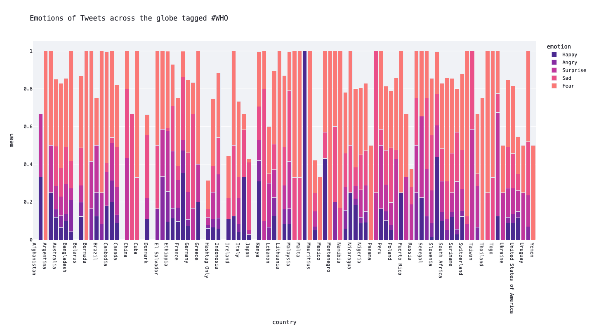
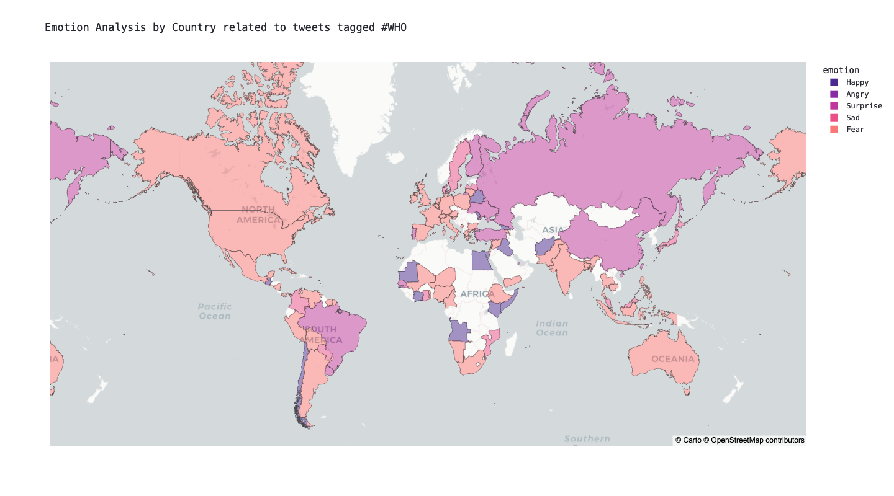
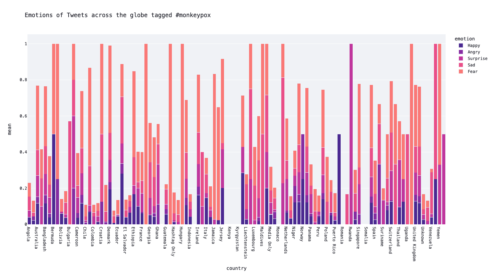
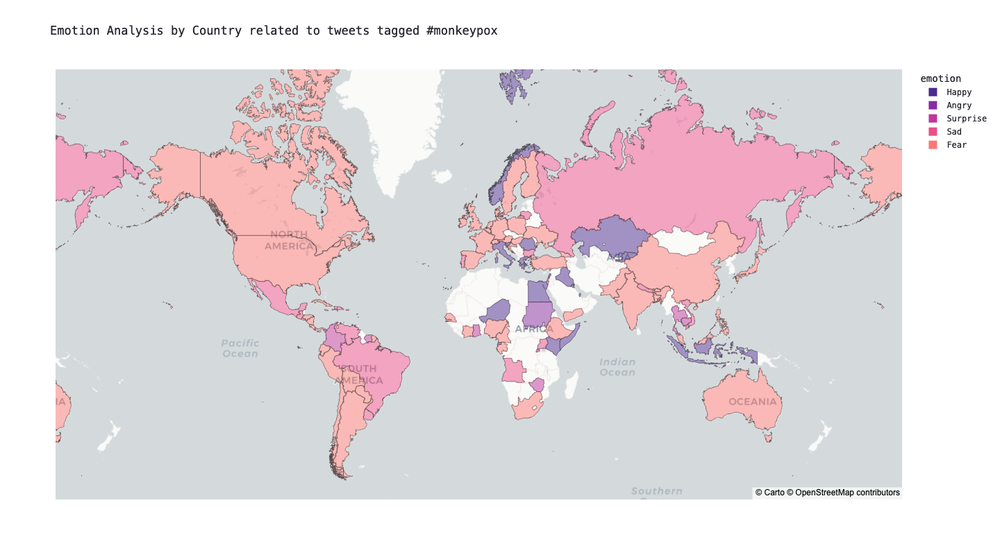
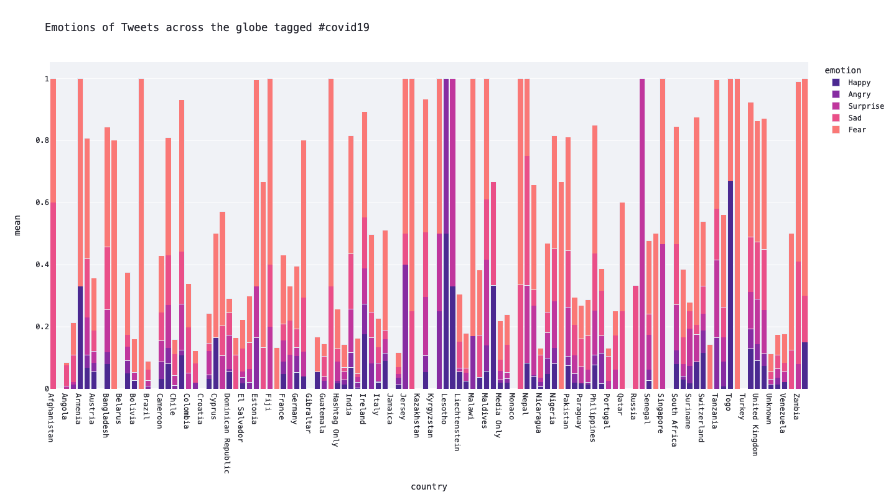
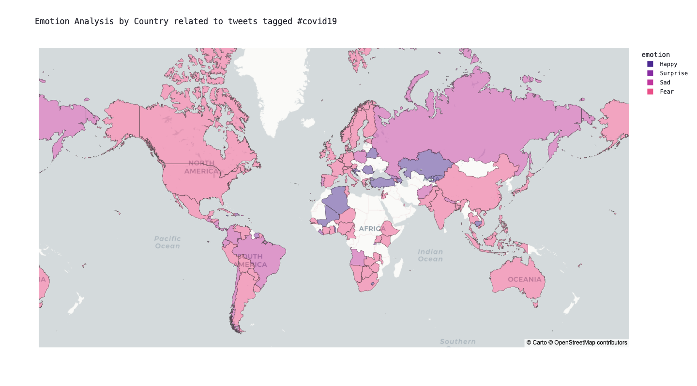

# streamlit-twitter-on-health

## Dissecting the public health discourse in the post-pandemic era
### Analysing hashtags across the globe

#### Explore insightful trends on Twitter by visiting the interactive visualization of the sentiment analysis
https://scopalaffairs-streamlit-twitter-on-hea-twitter-on-health-2jfica.streamlit.app/














## Setup (first time only)

Download static reference data (not in git):
```bash
curl -o data-final/countries.geojson \
  "https://raw.githubusercontent.com/datasets/geo-countries/master/data/countries.geojson"
curl -o data-final/plotly_countries.csv \
  "https://raw.githubusercontent.com/plotly/datasets/master/2014_world_gdp_with_codes.csv"
```

Pre-aggregate the raw JSON files into small CSVs (needs to run once, or whenever source data changes):
```bash
python preprocess.py
```

This produces `data-final/melted_*.csv` — a few KB each. The app loads only these files at runtime; the raw JSON files (~140 MB total) are no longer needed on the server.

## Deployment (Production Server)

The app runs as user `deploy` on port 8501, managed by systemd (`streamlit-twitter.service`).

**Pull latest changes and restart:**
```bash
cd /home/deploy/streamlit-twitter-on-health
git pull
sudo systemctl restart streamlit-twitter
```

**Check status / logs:**
```bash
systemctl status streamlit-twitter
journalctl -u streamlit-twitter -f
```

### Systemd memory limit (important on shared servers)

Add a drop-in to cap the process so it can never take down co-hosted services:

```bash
sudo mkdir -p /etc/systemd/system/streamlit-twitter.service.d
sudo tee /etc/systemd/system/streamlit-twitter.service.d/limits.conf << 'EOF'
[Service]
MemoryMax=512M
MemorySwapMax=0
EOF
sudo systemctl daemon-reload
sudo systemctl restart streamlit-twitter
```

Adjust `512M` to whatever headroom your server has. With the pre-aggregated CSVs the app idles well under 100 MB.
